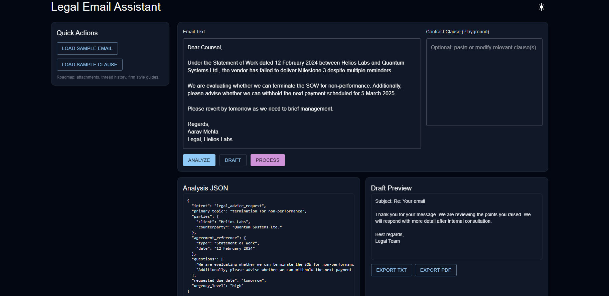

<div align="center">

# Legal Email Assistant

**AI-powered legal response generation using LangChain, LangGraph, and Google Gemini**

[](https://fastapi.tiangolo.com/)
[](https://nextjs.org/)
[](https://python.org/)
[](https://langchain.com/)
[](https://tailwindcss.com/)

</div>

---

## Overview

A production-grade full-stack application that analyzes legal emails and automatically generates professional responses by retrieving relevant contract clauses. Built with modern AI engineering practices including state machine workflows, vector search, and intelligent caching.

**Tech Stack:** FastAPI · Next.js · LangChain · LangGraph · Google Gemini · FAISS · SQLite · Material-UI · Tailwind CSS

---

## System Architecture


---

## Application Interface

<div align="center">




</div>

---

## Key Features

### Two-Stage AI Pipeline
- Email analysis extracts structured data (parties, topics, risk assessment)
- Response generation synthesizes professional drafts with contract references

### Retrieval-Augmented Generation (RAG)
- FAISS vector store for semantic search over contract clauses
- Intelligent clause retrieval based on email topics

### Production-Ready Backend
- FastAPI with rate limiting and CORS
- Dual-layer caching (in-memory + SQLite)
- Pydantic schemas for type safety
- Mock LLM fallback for testing and offline mode
- Comprehensive pytest suite

### Modern Frontend
- Next.js 14 with React 18
- Material-UI components with Tailwind CSS
- Real-time JSON analysis viewer
- Draft comparison tool
- Dark mode support
- PDF and Word export

---

## Quick Start

### Prerequisites
- Python 3.10+
- Node.js 18+
- Google Gemini API key

### Backend Setup

```bash
cd backend
pip install -r requirements.txt

# Create .env file with your API key
echo "GEMINI_API_KEY=your_api_key_here" > .env

# Start server
uvicorn api.main:app --reload --port 8000
```

### Frontend Setup

```bash
cd frontend
npm install
npm run dev
```

Visit `http://localhost:3000`

### Running Tests

```bash
cd backend
pytest -q
```

Tests run with mock LLM if `GEMINI_API_KEY` is not set, ensuring CI/CD compatibility.

---

## API Endpoints

| Endpoint | Method | Description |
|----------|--------|-------------|
| `/health` | GET | Health check |
| `/api/analyze` | POST | Extract structured data from email |
| `/api/draft` | POST | Generate legal response |
| `/api/process` | POST | Full pipeline (analyze + draft) |

### Example Request

```bash
curl -X POST http://localhost:8000/api/process \
  -H "Content-Type: application/json" \
  -d '{
    "email_text": "When can we expect delivery per our contract?",
    "contract_snippet": "Clause 9.1: Delivery within 30 days..."
  }'
```

---

## Project Structure

```
backend/
├── api/
│   ├── main.py              # FastAPI app with middleware
│   └── routes.py            # API endpoint definitions
├── agents/
│   ├── analyze_node.py      # Email analysis logic
│   ├── draft_node.py        # Response generation logic
│   ├── graph.py             # LangGraph orchestration
│   └── heuristics.py        # Business rules
├── services/
│   ├── llm.py               # Gemini LLM wrapper
│   ├── cache.py             # Caching layer
│   └── vectorstore.py       # FAISS retrieval
├── models/
│   └── schemas.py           # Pydantic data models
└── tests/                   # Comprehensive test suite

frontend/
├── src/
│   ├── pages/
│   │   ├── _app.js          # Next.js app wrapper
│   │   └── index.js         # Main application page
│   ├── components/
│   │   ├── Editor.js        # Email input component
│   │   ├── AnalysisViewer.js
│   │   ├── DraftPreview.js
│   │   └── CompareDrafts.js
│   └── hooks/
│       └── useLocalStorage.js
└── styles/
    └── globals.css          # Tailwind + custom styles
```

---

## Technology Stack

| Layer | Technologies |
|-------|-------------|
| **Frontend** | Next.js 14, React 18, Material-UI, Tailwind CSS, Framer Motion |
| **Backend** | FastAPI, Uvicorn, Python 3.10+ |
| **AI/ML** | LangChain, LangGraph, Google Gemini, FAISS |
| **Data** | SQLite, Pydantic |
| **Testing** | Pytest, httpx |
| **DevOps** | Python-dotenv, Watchfiles |

---

## Workflow Pipeline

1. **Email Input** → User submits legal email via React interface
2. **Analysis Phase** → LangGraph Node 1 extracts structured data
3. **Retrieval Phase** → FAISS searches relevant contract clauses
4. **Generation Phase** → LangGraph Node 2 synthesizes professional response
5. **User Review** → Interactive UI displays analysis and draft with export options

---

## Configuration

### Environment Variables

**Backend (`backend/.env`):**
```env
GEMINI_API_KEY=your_gemini_api_key
CACHE_TTL=3600
RATE_LIMIT_REQUESTS=100
RATE_LIMIT_WINDOW=60
```

**Frontend:**
```env
NEXT_PUBLIC_API_BASE=http://localhost:8000
```

---

## Production Considerations

### Implemented
- Rate limiting to prevent API abuse
- Dual-layer caching for performance
- Graceful degradation with mock LLM fallback
- Comprehensive error handling
- CORS configuration for cross-origin requests
- Environment-based configuration
- Automated testing suite

### Roadmap
- Multi-document contract ingestion
- User authentication and session management
- Advanced chunking strategies for long documents
- Vector database scaling (Milvus/pgvector)
- Prompt versioning and A/B testing
- Real-time collaboration features
- PDF export backend service

---

## Why This Project Stands Out

- **Production-Ready Architecture** - Not a proof-of-concept, but a fully functional application
- **Modern AI Stack** - Leverages cutting-edge LangChain/LangGraph patterns
- **Type Safety** - End-to-end type checking with Pydantic
- **Comprehensive Testing** - Mock strategies ensure CI/CD reliability
- **Polished UX** - Professional interface with animations and thoughtful interactions
- **Scalable Design** - Modular structure ready for enterprise deployment

---

## Troubleshooting

**Import errors for `langgraph` or `langchain-google-genai`:**
- Verify `backend/requirements.txt` versions and reinstall dependencies

**FAISS/embedding errors:**
- System automatically falls back to basic snippet loader

**CORS issues:**
- Confirm backend runs on port 8000 and frontend on port 3000
- Check CORS configuration in `backend/api/main.py`

**Tests failing:**
- Ensure mock LLM is properly configured
- Run `pytest -v` for detailed output

---

<div align="center">

**Built with modern AI engineering practices | Ready for production deployment**

</div>
